# Phase 2
Ce rapport a pour but de décrire le travail effectué durant la phase 2 de ce projet de TWEB.

Corrections
-----------
Nous avons apporté quelques modifications au code de la phase 1 et avons corrigé quelques problèmes:

- Les statistiques ont été corrigées, elles n'étaient ni fausses ni mal calculées, mais ne correspondaient pas à ce que l'on pourrait intuitivement s'attendre

- Comme demandé, le projet a été angularisé et notre site est, une web-application sur une seule page, où les opérations s'effectuent avec le moins de rafraîchissements possibles 

- Nous avons continué d'enrichir notre API en corrigeant certains petits bugs et en ajoutant des chemins.

Interface
---------
Notre ancien thème étant très sobre, nous avons décidé de faire une refonte de l'interface, premièrement en choisissant un autre thème, un petit peu plus riche, puis, deuxièmement, en changeant de nom. Nous avions en effet choisi d'appeler notre site **QPoll**, ce qui ne correspondait à rien de précis, et nous l'avons rebaptisé **NorthPoll**, en lien avec notre nouveau thème.

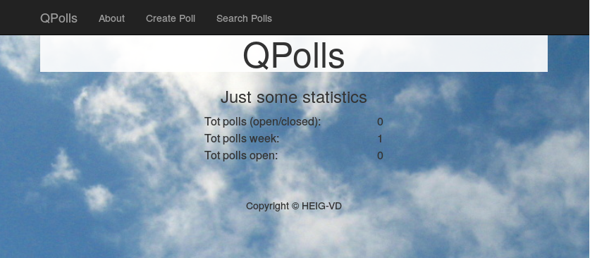

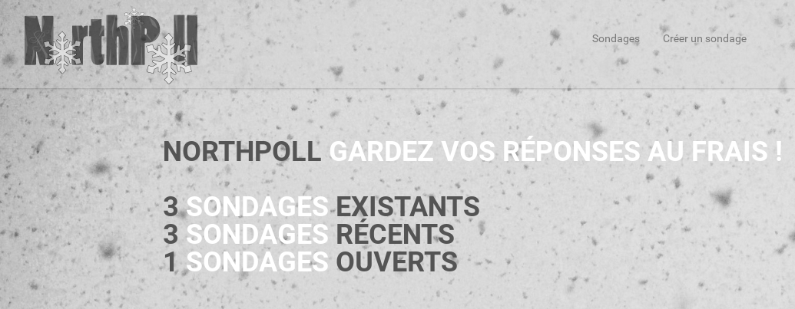

Notre nouveau thème, même s'il reste sobre, est plus fourni que le précédent et possède un thème de couleurs proche du monochrome. L'exemple d'utilisation de base étant dans le thème de l'hiver et de la neige, nous avons repris cette idée, d'où nous tirons le nom **NorthPoll**. Il reste malheureusement encore des détails plus ou moins importants à corriger, ce que nous faisons au fur et à mesure de l'avancement du projet.

Instances
---------

Nous avons mieux réfléchi au fonctionnement de notre application et avons introduit la notion d'*instance* de sondage.

Notre première intention, dans la phase 1, était de simplement pouvoir définir qu'un sondage était ouvert ou fermé. Cependant, nous ne nous étions pas demandé ce qu'il adviendrait des résultats déjà existants si un sondage était fermé, modifié, puis réouvert. En effet, les anciens résultats n'auraient plus eu de sens, les questions et leurs choix ayant pu être complètement modifiés entre temps.

D'autre part, la simple notion d'être ouvert ou fermé nous empêchait de lancer plusieurs fois le sondage afin d'en comparer les résultats, comme par exemple créer un sondage et y faire participer deux classes parallèles. Nous avions alors éventuellement pensé qu'il serait possible de copier un sondage ou l'exporter.

Dans cette phase 2, nous avons donc décidé d'agir différemment. Nous nous basons sur les mêmes schémas qu'un langage orienté objet: un sondage est une classe, et celui-ci peut être *instancié* plusieurs fois, en parallèle s'il le faut. D'autre part, chaque instance étant indépendante des autres, les nouvelles instances, créées après modification du sondage, peuvent posséder des questions/choix différents des instances ayant été créées dans une ancienne version du sondage.

Ainsi nous gérons les deux problèmes susmentionnés:

- Les résultats sont gardés même si le sondage est modifié et affichent simplement les questions et réponses du sondage dans l'état où il était lorsque l'instance a été créée.

- Il est possible de lancer plusieurs fois le sondage en même temps, en précisant un nom différent pour chacune des instances.

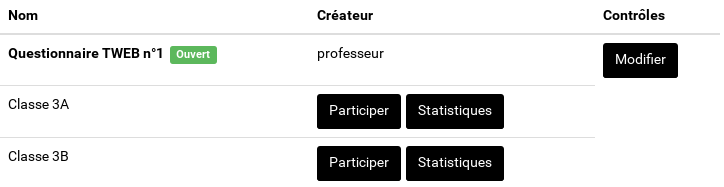

Nous avons donc modifié notre  [API REST](Rest.md) en conséquence afin de gérer tout ce mécanisme.

Liste des sondages
------------------
Nous avons créé une interface présente sur la page d'accueil qui liste les sondages existants de manière simple et propre:

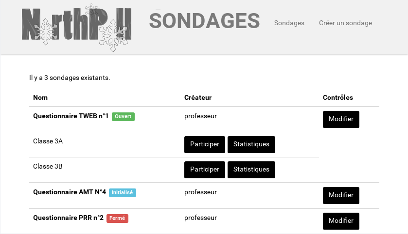

Cette liste affiche tous les sondages, quel que soit leur état, et indique, au moyen d'un label coloré, le statut de chacun:

- *Initialisé* : état par défaut d'un sondage lorsqu'il est créé. Le sondage existe dans la base de données, mais son créateur n'a pas fini de créer les questions. Aucune instance n'existe pour ce sondage.

- *Ouvert* : Le sondage possède une ou plusieurs instances et il est possible d'y participer.

- *Fermé* : Le sondage est fermé, les instances sont vérouillées et les résultats sont figés.

En dessous du nom d'un sondage sont affichées les instances existantes, s'il y en a. C'est dans cette zone qu'il est possible d'y participer en cliquant sur "Participer" ou d'afficher les statistiques en temps réel en cliquant sur "Statistiques".

Le bouton "Modifier" permettra (en phase 3), en saisissant le mot de passe associé au sondage, de le modifier: modifier ses propriétés, gérer les questions et leurs choix, gérer les instances. La page affichée est la même que pour la création, où les champs sont déjà pré-remplis.

Création de sondages
--------------------

Cette interface, qui est aussi celle qui permettra de modifier le sondage, permet de créer un nouveau sondage, d'y insérer des questions, et de créer des instances.

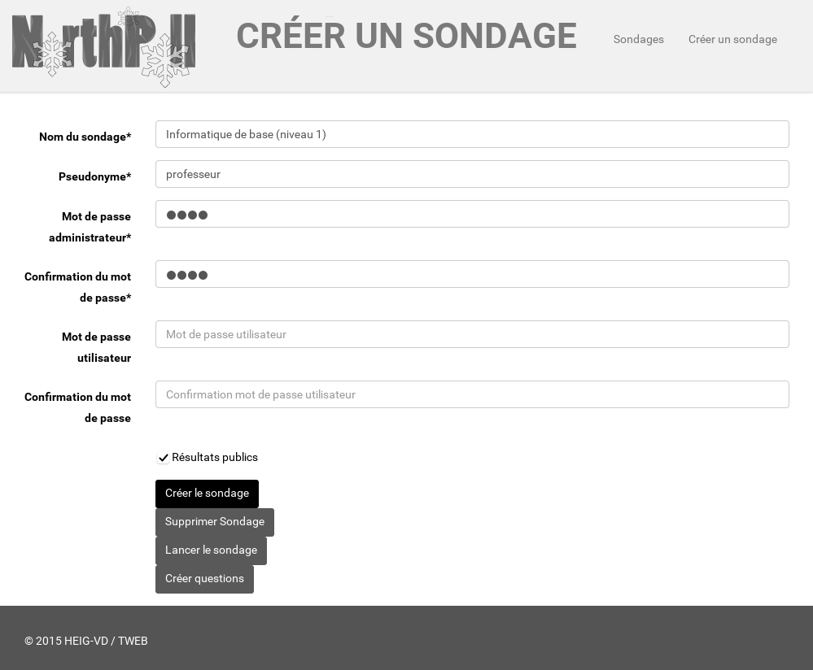

Une fois toutes les propriétés saisies, il suffit de cliquer sur le bouton "Créer le sondage" (qui est de toute façon le seul disponible) pour créer immédiatement le sondage via l'API REST. Une fois le sondage créé, il est possible d'y insérer des questions en cliquant sur le bouton "Créer questions" qui fera apparaître la page suivante.

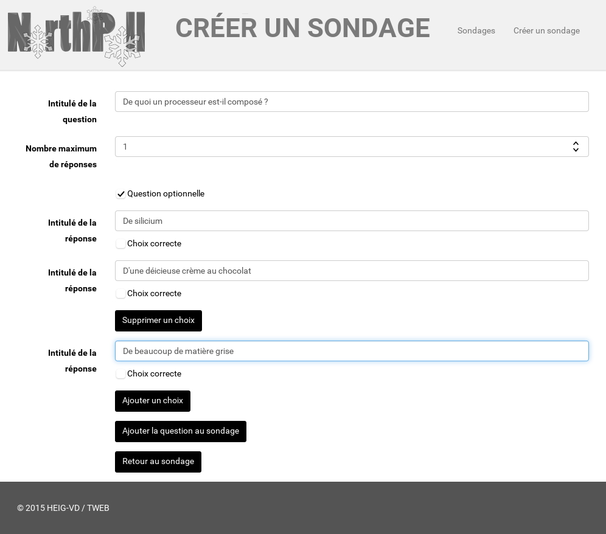

Ce formulaire permet de créer une question et les choix qui y sont associés. Une question peut être optionnelle (il n'est pas nécessaire d'y répondre pour soumettre les résultats), et/ou avoir plusieurs choix choix corrects possible, pouvant être sélectionnés simultanément. Un choix peut être marqué comme étant correct ou non et est enregistré côté serveur, mais n'est pas utilisé pour le moment.

Répondre à un sondage
---------------------

Lorsqu'un sondage est ouvert et que l'on clique sur "Participer", les questions sont chargées via l'API REST et l'interface de réponse apparaît directement à la première question:   (HEUUUUUUU Y AVAIT PAS EVENTUELLEMENT UN MOT DE PASSE????)

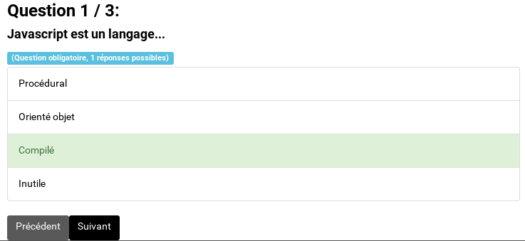

L'entête de la question affiche la progression dans le sondage (question actuelle / nombre de questions) et un label coloré affiche le nombre de choix qu'il est possible de sélectionner simultanément pour la question en cours, et si elle est obligatoire ou optionelle.

Y répondre est très simple, il suffit de cliquer sur le choix désiré et le/les choix sélectionnés s'affichent en vert clair.

Lorsqu'un ou plusieurs choix sont sélectionnés, il est possible de passer à la question suivante. Cependant, il est possible de "sauter" une question sans y répondre si celle-ci n'est pas obligatoire:

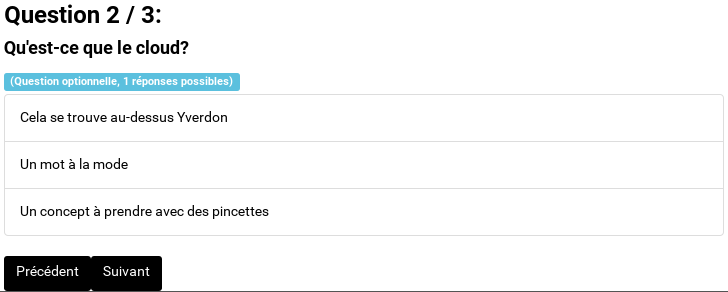

Ici, aucun choix n'est sélectionné, mais le bouton pour passer à la question suivante est activé. À noter aussi que le bouton "Précédent" permet de revenir à la question précédente, pour laquelle les choix sélectionnés ont été mémorisés. Il est ainsi possible de naviguer en toute aisance dans le questionnaire.

Enfin, le support des choix multiples coule de source, il suffit d'en sélectionner plusieurs:

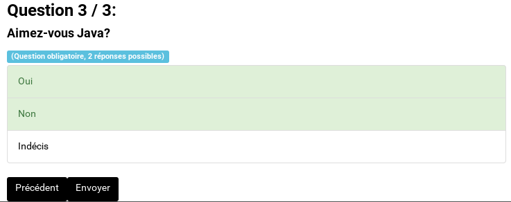

A la dernière question du sondage, le bouton "Suivant" a été renommé en "Envoyer". Un clic sur ce bouton envoie immédiatement les données au serveur.

Visualiser les résultats
------------------------

Enfin, lorsque l'on clique sur le bouton "Statistiques" d'un sondage, il est possible d'en obtenir les résultats. Un sondage peut être public à la consultation ou non, le cas échéant, seul l'administrateur peut visualiser les résultats.

Ce bouton ouvre l'interface qui affiche les résultats par question, sous forme d'un "camembert":

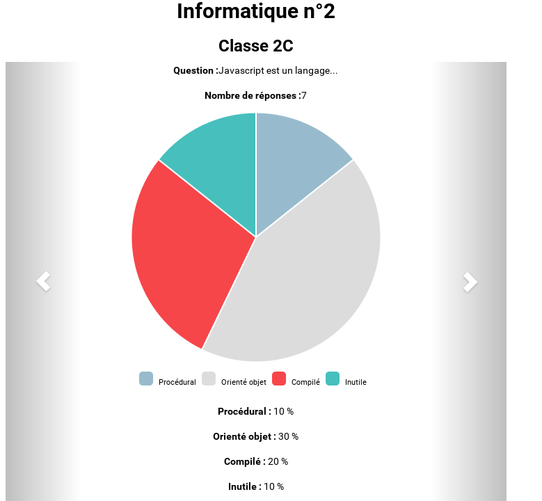

Il est possible de passer à la question précédente/suivante en cliquant sur les flèches à gauche et à droite de la figure. Le style de graphique est à revoir, nous n'allons peut-être pas garder le "camembert" et le remplacer par un diagramme en barre, plébiscité par les statisticiens. D'autre part, le dégradé gris peu esthétique sera supprimé.

Les résultats pour chaque question s'afficheront en temps réel grâce à socket.io.

Bilan par rapport aux maquettes
-------------------------------
Qu'en est-il de notre projet actuel par rapport aux maquettes que nous avions prévues? Le voici en images:

**Page d'accueil**
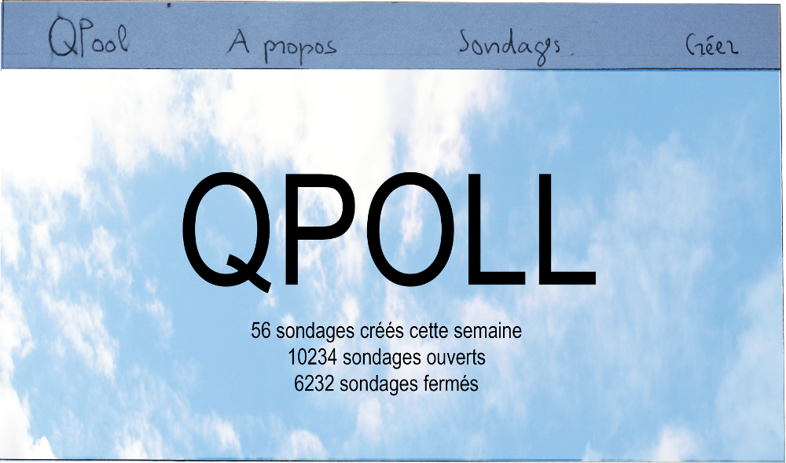

Comme indiqué précédemment, nous avons finalement opté pour un thème plus sobre que celui prévu, ce qui n'est pas un mal, l'ancien étant un peu chargé visuellement.

**Liste des sondages**
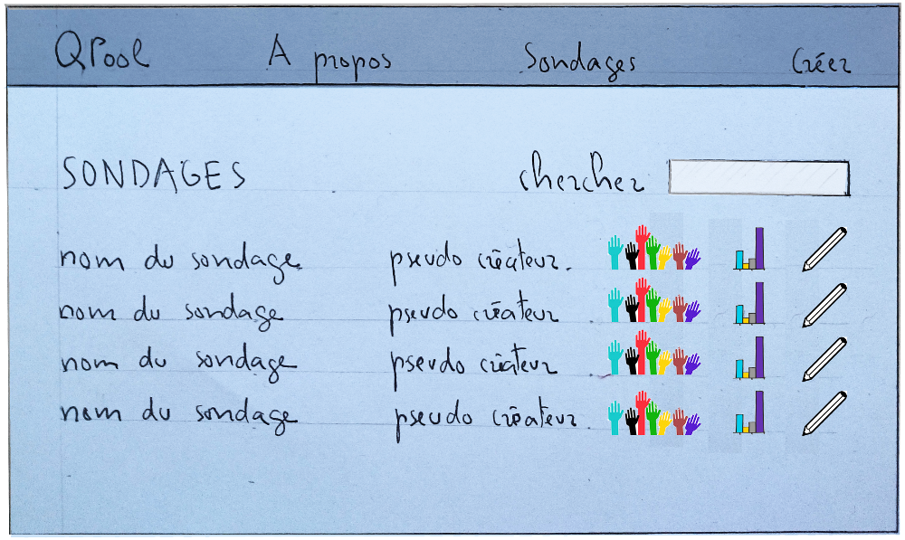

Dans la maquette, nous n'avions pas prévu le mécanisme des instances, c'est pourquoi la liste des sondages paraît plus compacte. Que ce soit la maquette ou l'interface actuelle, nous avons réussi à afficher les sondages de manière claire et simple d'utilisation. À noter que le design de notre site n'est pas final, il est tout à fait possible que nous options pour les mêmes types d'icônes que dans la maquette.

**Création d'un sondage**

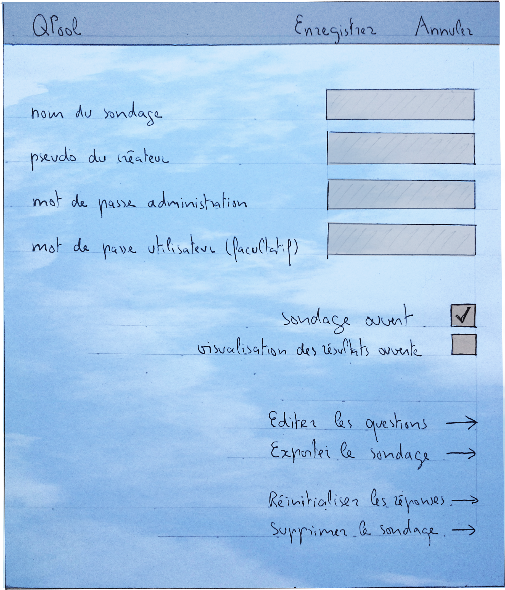

À nouveau, avec l'introduction du mécanisme des instances, la case à cocher "sondage ouvert" n'a plus lieu d'être, de même que les liens "Exporter le sondage" et "Réinitialiser les réponses". Sinon, le formulaire reste un formulaire et, excepté un peu de mise en page à faire en phase 3, nous n'allons pas trop nous éloigner de ce que nous avions prévu.

Travail restant dans la phase suivante
---------------
- **Modifier un sondage** : La page permettant de créer un sondage devra permettre de reprendre les données d'un sondage existant et d'effectuer des requêtes PUT et DELETE afin de les modifier ou d'effectuer une suppression. Il en est de même pour les questions. L'API REST devra bien évidemment prendre en charge toutes ces requêtes et reporter les changements dans la base de données.

- **Lister/modifier les instances** : L'interface de création/modification de sondage devra aussi permettre de lister les instances actuelles et permettre de les modifier. De même, il devra être possible d'ouvrir et fermer totalement un sondage.

- **Statut et erreurs** : Actuellement, les *feedback* à l'utilisateur sont faits au moyen de fenêtres  jaillissantes (*popup*) ce qui est peu agréable. Nous allons mettre en place un champ de statut indiquant si une action s'est déroulée avec succès ou non.

- **Transfert de données entre les pages** : Actuellement, pour exemple, lorsqu’on clique sur le bouton **statistiques** pour une instance. Angular se charge de récupérer l’id de l’instance qu’il stocke dans une factory. Ui-router change ensuite le contenu de sa div selon son nouvel état « statistiques ». Le contrôleur Angular de la nouvelle page se charge finalement de récupérer l’id de l’instance depuis la factory. Cette manière de transfert de données s’avère être mauvaise car lorsqu’un utilisateur rafraichit sa page courante la factory Angular est réinitialisée, ce qui a pour conséquence la perte de l’id de l’instance. Notre page, par exemple, statistiques d’une instance, ignore pour quelle instance elle doit afficher les statistiques. Il nous semble préférable de transférer l’id à travers un paramètre de requête dans l’url. Nous analyserons la meilleure façon de faire durant la dernière phase.

- **Mise à jour dynamique des statistiques** : Actuellement, l'utilisateur en train de consulter les statistiques d'une instance doit rafraichir à chaque fois sa page pour obtenir les dernières mises à jour. Il serait préférable que lorsqu’un utilisateur termine et confirme sa participation à une instance, le serveur se charge lui-même d’envoyer une requête au client qui lui enverra une requête de mise à jour au serveur, tout cela sans l’intervention manuelle de l’utilisateur. Cette fonctionnalité peut être réalisée aisément à l’aide de *socket.io*. À noter qu’actuellement *socket.io* est intégré dans notre projet mais sa seule fonctionnalité est d’afficher sur la console côté serveur « A user has connected » validant le bon fonctionnement de la communication client-serveur. 

- **Correction d'un bug à l'affichage de la page d'accueil** : Lorsque nous rafraichissons la page principale du site, la bannière de statistiques s’affiche correctement. Mais lorsque l’on se déplace sur **Créer un sondage** et qu’on revient sur sondages, la bannière ne s’affiche plus. Pourtant, lors d’un rafraichissement de la page principale, notre div *ui-view* ne fait que inclure notre fichier jade contenant la bannière et les sondages ; même fichier jade qui est affiché par ui-router lorsqu’on clique sur le lien **sondages**.

- **Amélioration de l'interface** : Nous allons ajouter un champ de recherche et mettre en place un mécanisme de pagination, deux mécanismes indispensables lorsque notre plateforme sera utilisée dans le monde entier! Nous allons globalement nettoyer notre interface et la rendre la plus intuitive possible, tout en gardant à l'esprit qu'aucun d'entre nous n'a de connaissances en web.
