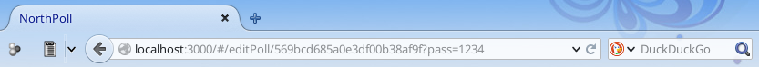

# Phase 3
Ce rapport a pour but de décrire le travail effectué durant la phase 3 de ce projet de TWEB.

Corrections
-----------
Nous avons apporté quelques modifications au code de la phase 2 selon les remarques qui nous avaient été faites:

- Le contrôleur gérant la partie de création/édition de sondage ne se base plus sur une chaîne de caractères en dur dans le scope pour déterminer la tâche à effectuer, mais sur une variable booléenne.

- Le contrôleur gérant la partie de création/édition de sondage a été découpé en sous-parties pour isoler les responsabilités. Désormais, en plus du contrôleur d'édition du sondage, il y a un nouveau contrôleur dédié à la gestion des questions et un autre pour gérer les instances. Les vues ont elles aussi été séparées dans d'autres fichiers jade.

- Nous avons fait un nettoyage du template que nous utilisons qui désormais n'a plus (ou presque) de bug d'affichage.

- Afin que l'étape de création du sondage soit plus claire pour l'utilisateur, la page affiche un feedback sous la forme d'une bannière notifiant l'utilisateur du succès ou de l'échec de son action.

- Afin que la création de questions soit plus claire, nous avons fait une refonte de l'interface de gestion/création de questions, plus épurée. D'autre part, celle-ci affiche un feedback à la création d'une question, de manière similaire au point précédent.

- L'interface de réponse aux questions a été améliorée. Désormais, le pointeur est modifié au survol d'un choix et le fond du choix lui-même est coloré. De cette manière, il est visuellement plus clair pour l'utilisateur qu'il peut cliquer sur les choix.

Améliorations et évolutions
---------
Comme spécifié à la fin du document sur la phase 2, nous avons travaillé sur les points qu'il restait à implémenter:

- **Modifier un sondage** : La page permettant de créer un sondage permet de reprendre les données d'un sondage existant et d'effectuer des requêtes PUT et DELETE afin de les modifier ou d'effectuer une suppression. L'[API REST](REST.md) a été modifiée en conséquence. D'autre part, de nouveaux contrôleurs nous permettent de faire de même avec les instances et les questions.

- **Lister/modifier les instances** : Une nouvelle interface permet de lister les instances actuelles et permet de les supprimer.

- **Statut et erreurs** : Tous les `alert` classiques ont été remplacés par un avertisseur générique moins invasif. En effet, nous avons créé une bannière s'affichant en haut de l'écran, permettant d'afficher tous types de messages et ayant une coloration variable, définie par es styles bootstrap `alert-success` (vert), `alert-info` (bleu), `alert-warning` (orange) et `alert-danger` (rouge).

- **Mise à jour dynamique des statistiques** : Tout utilisateur en train de consulter les statistiques d'une instance doit obtient les dernières mises à jour en direct. Lorsqu’un utilisateur termine et confirme sa participation à une instance, le serveur se charge de mettre à jour la page des résultats, tout cela sans l’intervention manuelle de l’utilisateur. Cette fonctionnalité a été réalisée  à l’aide de *socket.io*.

- **Correction des bugs d'affichage** : Nous avons réglé la plupart de nos bugs d'affichages présents dans la phase précédente. Désormais, l'interface est épurée et fluide.

- **Amélioration de l'interface** : Nous n'avons malheureusement pas eu le temps d'ajouter un champ de recherche et mettre en place un mécanisme de pagination. En effet, nous avons été pris par la correction des bugs existants et la gestion des nouveaux éléments. Toutefois, la gestion de la pagination est implémentée du côté serveur depuis la phase 2. En effet, les requêtes `GET /api/polls/<draft|open|closed>` prennent des paramètres ```?from=x&nb=y``` qui permettent de gérer les pages.

Structure du site
-----------
Voici schématiquement la structure du site:


Les flèches sont les interactions logiques.

Depuis toute page du site, y compris la page d'accueil, qui affiche simplement les statistiques actuelles du site, il est possible de directement "sauter" vers les pages de création de sondage ou de liste des sondages. Les flèches sont donc représentatives des actions "logiques" que l'on peut effectuer sur une page.

**Page d'accueil**


La page d'accueil affiche quelques statistiques concernant les sondages actuellement présents sur le serveur. Le bouton explorer mène directement sur la page de liste des sondages, aussi accessible via le menu en haut à droite.

**Liste des sondages et des instances**


Cette page liste les sondages actuellement disponibles et une pastille indique leur état. En dessous de chacun d'entre eux sont listées les instances de chaque sondage, et deux boutons permettent de participer au sondage (peut requérir un mot de passe) et de visualiser les résultats en temps réel. Tout à leur droite, un bouton permet de gérer le sondage (modifier ses propriétés, gérer les questions, gérer les instances).

**Participer à un sondage**


Lorsque l'on clique sur "Participer" sur une instance d'un sondage et que l'on fournit le bon mot de passe (s'il y a lieu), cette page s'ouvre et permet de répondre aux questions du sondage sélectionné. Les boutons "précédent" et "suivant" permettent de passer d'une question à l'autre. Lorsque l'on est sur la dernière question, le bouton "suivant" se renomme en "envoyer" qui permet de soumettre ses réponses.

Lorsque l'utilisateur répond aux questions, il peut sélectionner un ou plusieurs choix (selon les paramètres de la question). Le pointeur de la souris se transforme en main et le choix se colore de bleu clair lorsque le pointeur survole un choix. Le clic permet de sélectionner ou désélectionner un choix. Les choix sélectionnés sont en vert clair.


Lorsque l'utilisateur accède aux résultats d'une instance, soit depuis la page de liste des sondages, soit depuis l'interface de gestion (lorsque les résultats ne sont pas publics), cette page s'affiche. Les résultats de chaque question sont visualisables en tant que diagramme en "camembert" montrant la proportion de chacun des choix possibles.


Cette interface présente la page de création et d'édition d'un sondage. En effet, c'est la même interface qui gère les deux actions. Cette capture affiche la page lorsque l'on crée un nouveau sondage, les champs sont tous vides, alors que lors de l'édition, les champs contiennent les données actuelles du sondage et permettent l'édition.

Les quelques contrôles dans la partie inférieure permettent de

- Créer le sondage
- Enregistrer les modifications
- Supprimer le sondage (supprime aussi les instances et les résultats)
- Gérer les questions (en ajouter ou les éditer)
- Gérer les instances (en ajouter, en supprimer)


Cette page s'affiche lorsque l'administrateur d'un sondage souhaite éditer les questions. Elle est accessible depuis la page d'édition d'un sondage en cliquant sur le bouton "Gérer les questions".

Ici, l'utilisateur a deux choix. Soit il reprend les données d'une question existante depuis le menu déroulant, soit il en crée une nouvelle. Dans les deux cas, les champs en dessous lui permettent de gérer l'intitulé de la question et les choix.


Tout comme pour la gestion des questions, cette page permet de gérer les instances d'un sondage. Il est possible directement ici d'en créer de nouvelles ou d'en supprimer. Dans cette interface, aucun feedback n'est  affiché sous a forme d'une bannière colorée comme c'était le cas plus haut, sauf en cas d'erreur.

En effet, si tout fonctionne correctement, la suppression d'instance va automatiquement supprimer la ligne dans laquelle se trouvais l'instance supprimée, et à la création d'une nouvelle instance, une nouvelle ligne est ajoutée. De manière visuelle, on se représente très clairement les changements opérés.

Pour chaque instance, il est possible de visualiser les résultats depuis cette page. Pratique de manière générale, cela permet de voir les résultats depuis un sondage dont les résultats ne sont pas publics.

Sécurité
--------

Actuellement, nous nous sommes assez peu préoccupés de la sécurité de notre application. En effet, nous avons préféré nous focaliser sur les fonctionnalités ainsi que l'interface, dans laquelle nous étions tous débutants.

Les notions de sécurité ont donc été de moindre importance, car ce projet ne sortira vraisemblablement jamais hors du cadre éducatif de l'école.

Toutefois, nous avons tout de même mis quelques petits contrôles, plutôt en tant que "proof of concept" que réelles entraves à la sécurité. Notamment, toute la partie de gestion d'un sondage, laquelle est accessible en fournissant le mot de passe d'administration défini à la création du sondage, est protégée du côté serveur. En effet, à chaque requête vers l'api, le mot de passe est transmis et contrôlé par le serveur avant d'effectuer les opérations. Cette couche de contrôle protège les pages "Gestion du sondage", "Gestion des questions", "Gestion des instances" et "Résultats d'une instance" (lorsque les résultats sont privés).

Les points qui seraient à améliorer dans un cadre productif sont donc les suivants:

- Le serveur sur lequel est hébergé le site (ou en tout cas l'API REST) doit être protégé avec un certificat TLS, ainsi les données transmises ne peuvent pas être interceptées par *sniffing*. En effet, les mots de passe d'administration et de participation (s'il est spécifié) transitent dans une communication HTTP en clair lors de la création d'un sondage et de l'accès à une page sécurisée.

- Actuellement, le mot de passe d'administration est transmis avec l'URL, lors de l'accès aux pages sécurisées. Ce mode de transmission devrait être changé en transmettant le mot de passe d'une autre manière, par exemple dans le header HTTP ou directement dans le corps de la requête. En effet, cette solution n'est pas franchement élégante, mais elle a surtout le défaut d'afficher le mot de passe en clair dans la barre d'adresse (et par conséquent stockée dans l'historique de l'utilisateur en clair aussi). Ainsi, toute personne observant l'écran peut connaître le mot de passe:



- Du côté serveur, dans la base de données mongodb, les mots de passe sont stockés directement en clair, en tant que texte. Il vaudrait mieux les stocker sous forme hâchée (md5, sha2, ...). Cela permettrait de ne pas exposer les données des utilisateurs si quelqu'un accède à la base de données de manière détournée. Le hâchage pourrait même s'effectuer côté client, le mot de passe ne transiterait ainsi jamais en clair par le réseau.

- Lors d'un POST, les points d'accès de notre API REST contrôlent la cohérence des données qui sont envoyées. Ainsi, une erreur sera générée s'il manque des informations obligatoires dans le JSON reçu, par exemple le mot de passe d'administration d'un sondage. Cependant, lorsque l'on soumet une participation, le serveur contrôle la cohérence de la structure du JSON mais pas son contenu. En effet, lorsqu'on soumet une réponse à une question, la question peut être obligatoire ou le nombre de choix sélectionnés par l'utilisateur est variable. Or tous ces contrôles sont fait côté client, mais pas côté serveur. Avec un outil manuel (HTTP Requester, Postman, ...) ou un outil automatisé plus puissant, il est facile de poster des résultats indésirables, avec des réponses manquantes à des questions obligatoires, ou une sélection de plusieurs choix alors qu'un seul est attendu, etc...

D'autres points restent encore probablement à désirer point de vue sécurité, mais les points ci-dessus sont ceux qui nous paraissent évidents.

À faire à l'avenir
------------------

Évidemment, quelques fonctionnalités amélioreraient l'expérience sur notre site et quelques fonctionnalités manquent s'il fallait l'utiliser en production:

- **Amélioration de l'interface** : Ajouter un champ de recherche et mettre en place un mécanisme de pagination, deux mécanismes indispensables lorsque notre plateforme sera utilisée dans le monde entier!

- **Améliorer la sécurité**: Ajouter plus de contrôle côté serveur qui garantissent une utilisation sécurisée de l'application.

- **Comptes**: Ajouter la possibilité de se créer un compte (en plus de proposer des services anonymes). Avec une notion d'identité, il serait plus facile de gérer ses propres sondages. De plus, cela permettrait d'introduire une notion plus "sociale" à l'application, voire même des mécanismes de gamification.

Conclusion
----------

Ne connaissant ni angular ni les langages du web de manière générale, ce projet a été très enrichissant mais aussi un grand défi pour nous. Globalement, nous pensons avoir fourni un bon résultat. Nous avons réussi à implémenter les fonctionnalités que nous avions prévues dans chaque phase et nous sommes parvenus à un bon compromis en terme d'ergonomie et d'esthétique.
