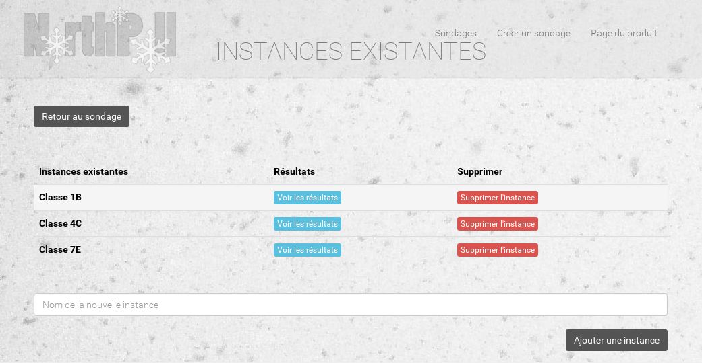

# Phase 3
Ce rapport a pour but de décrire le travail effectué durant la phase 3 de ce projet de TWEB.

Corrections
-----------
Nous avons apporté quelques modifications au code de la phase 2 selon les remarques qui nous avaient été faites:

- Le contrôleur gérant la partie de création/édition de sondage ne se base plus sur une chaîne de caractères en dur dans le scope pour déterminer la tâche à effectuer, mais sur une variable booléenne.

- Le contrôleur gérant la partie de création/édition de sondage a été découpé en sous-parties pour isoler les responsabilités. Désormais, en plus du contrôleur d'édition du sondage, il y a un nouveau contrôleur dédié à la gestion des questions et un autre pour gérer les instances. Les vues ont elles aussi été séparées dans d'autres fichiers jade.

- Nous avons fait un nettoyage du template que nous utilisons qui désormais n'a plus (ou presque) de bug d'affichage.

- Afin que l'étape de création du sondage soit plus claire pour l'utilisateur, la page affiche un feedback sous la forme d'une bannière notifiant l'utilisateur du succès ou de l'échec de son action.

- Afin que la création de questions soit plus claire, nous avons fait une refonte de l'interface de gestion/création de questions, plus épurée. D'autre part, celle-ci affiche un feedback à la création d'une question, de manière similaire au point précédent.

- L'interface de réponse aux questions a été améliorée. Désormais, le pointeur est modifié au survol d'un choix et le fond du choix lui-même est coloré. De cette manière, il est visuellement plus clair pour l'utilisateur qu'il peut cliquer sur les choix.

Améliorations et évolutions
---------
Comme spécifié à la fin du document sur la phase 2, nous avons travaillé sur les points qu'il restait à implémenter:

- **Modifier un sondage** : La page permettant de créer un sondage permet de reprendre les données d'un sondage existant et d'effectuer des requêtes PUT et DELETE afin de les modifier ou d'effectuer une suppression. L'[API REST](REST.md) a été modifiée en conséquence. D'autre part, de nouveaux contrôleurs nous permettent de faire de même avec les instances et les questions.

- **Lister/modifier les instances** : Une nouvelle interface permet de lister les instances actuelles et permet de les supprimer.

- **Statut et erreurs** : Tous les `alert` classiques ont été remplacés par un avertisseur gébérique moins invasif. En effet, nous avons créé une bannière s'affichant en haut de l'écran, permettant d'afficher tous types de messages et ayant une coloration variable, définie par es styles bootstrap `alert-success` (vert), `alert-info` (bleu), `alert-warning` (orange) et `alert-danger` (rouge).

- **Transfert de données entre les pages** : ??????????????????????

- **Mise à jour dynamique des statistiques** : Tout utilisateur en train de consulter les statistiques d'une instance doit obtient les dernières mises à jour en direct. Lorsqu’un utilisateur termine et confirme sa participation à une instance, le serveur se charge de mettre à jour la page desrésultats, tout cela sans l’intervention manuelle de l’utilisateur. Cette fonctionnalité a été réalisée  à l’aide de *socket.io*.

- **Correction des bugs d'affichage** : Nous avons réglé la plupart de nos bugs d'affichages présents dans la phase précédente. Désormais, l'interface est épurée et fluide.

- **Amélioration de l'interface** : Nous n'avons malheureusement pas eu le temps d'ajouter un champ de recherche et mettre en place un mécanisme de pagination. En effet, nous avons été pris par la correction des bugs existants et la gestion des nouveaux éléments. Toutefois, la gestion de la pagination est implémentée du côté serveur depuis la phase 2. En effet, les requêtes `GET /api/polls/<draft|open|closed>` prennent des paramètres ```?from=x&nb=y``` qui permettent de gérer les pages.

Structure du site
-----------
Voici schématiquement la structure du site:


Les flèches sont les interactions logiques.

Depuis toute page du site, y compris la page d'accueil, qui affiche simplement les statistiques actuelles du site, il est possible de directement "sauter" vers les pages de création de sondage ou de liste des sondages. Les flèches sont donc représentatives des actions "logiques" que l'on peut effectuer sur une page.

**Page d'accueil**


La page d'accueil affiche quelques statistiques concernant les sondages actuellement présents sur le serveur. Le bouton explorer mène directement sur la page de liste des sondages, aussi accessible via le menu en haut à droite.

**Liste des sondages et des instances**


Cette page liste les sondages actuellement disponibles et une pastille indique leur état. En dessous de chacun d'entre eux sont listées les instances de chaque sondage, et deux boutons permettent de participer au sondage (peut réquérir un mot de passe) et de visualiser les résultats en temps réel. Tout à leur droite, un bouton permet de gérer le sondage (modifier ses propriétés, gérer les questions, gérer les instances).



